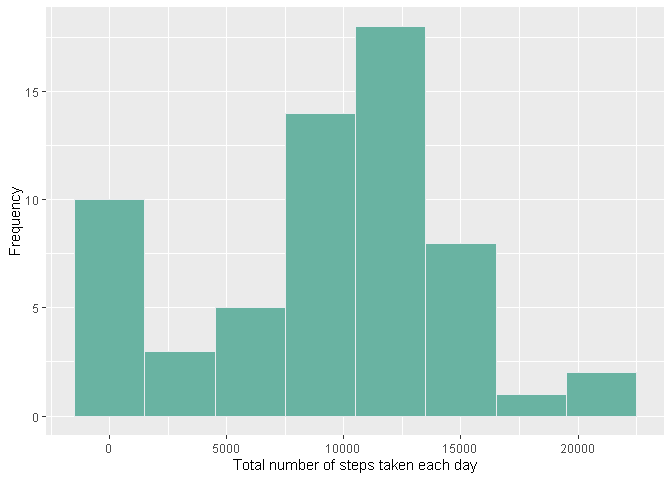
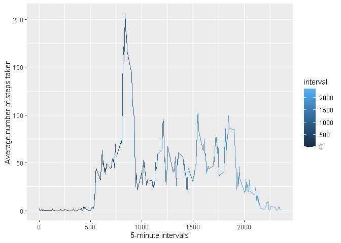
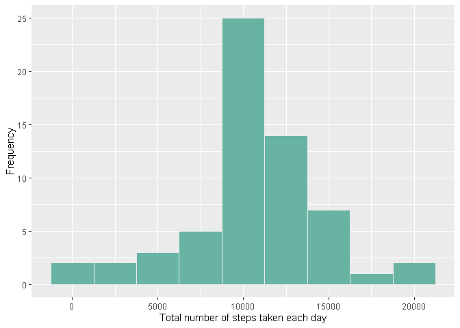
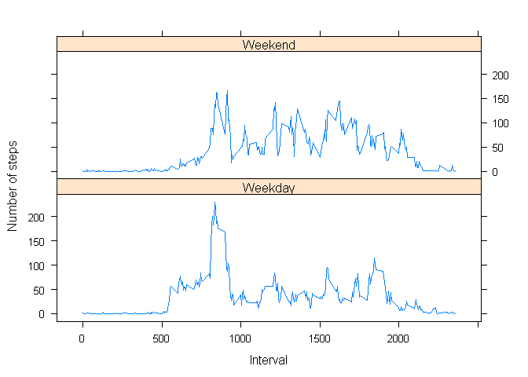

##Loading packages

```r
library(tidyverse)
```

```
## -- Attaching packages ------------------------------------------------------------ tidyverse 1.3.0 --
```

```
## v ggplot2 3.3.3     v purrr   0.3.4
## v tibble  3.0.3     v dplyr   1.0.2
## v tidyr   1.1.2     v stringr 1.4.0
## v readr   1.3.1     v forcats 0.5.0
```

```
## -- Conflicts --------------------------------------------------------------- tidyverse_conflicts() --
## x dplyr::filter() masks stats::filter()
## x dplyr::lag()    masks stats::lag()
```

```r
library(lubridate)
```

```
## 
## Attaching package: 'lubridate'
```

```
## The following objects are masked from 'package:base':
## 
##     date, intersect, setdiff, union
```

```r
library(lattice)
```

## Loading and preprocessing the data


```r
fileUrl <- "https://d396qusza40orc.cloudfront.net/repdata%2Fdata%2Factivity.zip"
download.file(fileUrl, destfile = paste0(getwd(), '/repdata%2Fdata%2Factivity.zip'), method = "curl")
unzip("repdata%2Fdata%2Factivity.zip")
```


```r
data <- read.csv("activity.csv")
class(data)
```

```
## [1] "data.frame"
```

```r
str(data)
```

```
## 'data.frame':	17568 obs. of  3 variables:
##  $ steps   : int  NA NA NA NA NA NA NA NA NA NA ...
##  $ date    : chr  "2012-10-01" "2012-10-01" "2012-10-01" "2012-10-01" ...
##  $ interval: int  0 5 10 15 20 25 30 35 40 45 ...
```

```r
summary(data)
```

```
##      steps            date              interval     
##  Min.   :  0.00   Length:17568       Min.   :   0.0  
##  1st Qu.:  0.00   Class :character   1st Qu.: 588.8  
##  Median :  0.00   Mode  :character   Median :1177.5  
##  Mean   : 37.38                      Mean   :1177.5  
##  3rd Qu.: 12.00                      3rd Qu.:1766.2  
##  Max.   :806.00                      Max.   :2355.0  
##  NA's   :2304
```

```r
head(data)
```

```
##   steps       date interval
## 1    NA 2012-10-01        0
## 2    NA 2012-10-01        5
## 3    NA 2012-10-01       10
## 4    NA 2012-10-01       15
## 5    NA 2012-10-01       20
## 6    NA 2012-10-01       25
```

## What is mean total number of steps taken per day?
1. Calculate the total number of steps taken per day


```r
total_steps <- data %>%
group_by(date) %>%
summarise(daily_steps = sum(steps, na.rm = TRUE))
```

```
## `summarise()` ungrouping output (override with `.groups` argument)
```

2. If you do not understand the difference between a histogram and a barplot, research the difference between them. Make a histogram of the total number of steps taken each day. 

Histogram

```r
ggplot(total_steps, aes(daily_steps)) + 
  geom_histogram(binwidth = 3000,fill="#69b3a2", color="#e9ecef") +
  xlab("Total number of steps taken each day") + 
  ylab("Frequency")
```

<!-- -->


3. Calculate and report the mean and median of the total number of steps taken per day
Mean

```r
mean_01 <- mean(total_steps$daily_steps, na.rm=TRUE)
mean_01
```

```
## [1] 9354.23
```
Median

```r
median_01 <- median(total_steps$daily_steps, na.rm=TRUE)
median_01
```

```
## [1] 10395
```

## What is the average daily activity pattern?
1. Make a time series plot (i.e. 𝚝𝚢𝚙𝚎 = "𝚕") of the 5-minute interval (x-axis) and the average number of steps taken, averaged across all days (y-axis)


```r
interval_steps <- data %>% 
  group_by(interval) %>%
  summarise(steps = mean(steps,na.rm =TRUE))
```

```
## `summarise()` ungrouping output (override with `.groups` argument)
```

```r
ggplot(data=interval_steps, aes(x=interval, y=steps, colour = interval)) +
    geom_line() +
    xlab("5-minute intervals") +
    ylab("Average number of steps taken")
```

<!-- -->

2. Which 5-minute interval, on average across all the days in the dataset, contains the maximum number of steps?


```r
interval_max <- interval_steps[which.max(interval_steps$steps),]$interval
interval_max
```

```
## [1] 835
```
The 835 contains the maximum number of steps


## Imputing missing values

1. Calculate and report the total number of missing values in the dataset (i.e. the total number of rows with 𝙽𝙰s)


```r
missing_values <- sum(is.na(data$steps))
missing_values
```

```
## [1] 2304
```

2. Devise a strategy for filling in all of the missing values in the dataset. The strategy does not need to be sophisticated. For example, you could use the mean/median for that day, or the mean for that 5-minute interval, etc.


```r
imputed_data <- data %>%
  mutate(
    steps = case_when(
      is.na(steps) ~ interval_steps$steps[match(data$interval, interval_steps$interval)],      
      TRUE ~ as.numeric(steps)
    ))
head(imputed_data, n=20)
```

```
##        steps       date interval
## 1  1.7169811 2012-10-01        0
## 2  0.3396226 2012-10-01        5
## 3  0.1320755 2012-10-01       10
## 4  0.1509434 2012-10-01       15
## 5  0.0754717 2012-10-01       20
## 6  2.0943396 2012-10-01       25
## 7  0.5283019 2012-10-01       30
## 8  0.8679245 2012-10-01       35
## 9  0.0000000 2012-10-01       40
## 10 1.4716981 2012-10-01       45
## 11 0.3018868 2012-10-01       50
## 12 0.1320755 2012-10-01       55
## 13 0.3207547 2012-10-01      100
## 14 0.6792453 2012-10-01      105
## 15 0.1509434 2012-10-01      110
## 16 0.3396226 2012-10-01      115
## 17 0.0000000 2012-10-01      120
## 18 1.1132075 2012-10-01      125
## 19 1.8301887 2012-10-01      130
## 20 0.1698113 2012-10-01      135
```

3. Create a new dataset that is equal to the original dataset but with the missing data filled in.


```r
imputed_total_steps <- imputed_data %>% group_by(date) %>% summarise(daily_steps = sum(steps))
```

```
## `summarise()` ungrouping output (override with `.groups` argument)
```

```r
imputed_total_steps
```

```
## # A tibble: 61 x 2
##    date       daily_steps
##    <chr>            <dbl>
##  1 2012-10-01      10766.
##  2 2012-10-02        126 
##  3 2012-10-03      11352 
##  4 2012-10-04      12116 
##  5 2012-10-05      13294 
##  6 2012-10-06      15420 
##  7 2012-10-07      11015 
##  8 2012-10-08      10766.
##  9 2012-10-09      12811 
## 10 2012-10-10       9900 
## # ... with 51 more rows
```

4. Make a histogram of the total number of steps taken each day and calculate and report the mean and median total number of steps taken per day. Do these values differ from the estimates from the first part of the assignment? What is the impact of imputing missing data on the estimates of the total daily number of steps?


```r
ggplot(imputed_total_steps, aes(daily_steps)) + 
  geom_histogram(binwidth = 2500, fill="#69b3a2", color="#e9ecef") + 
  xlab("Total number of steps taken each day") + 
  ylab("Frequency")
```

<!-- -->

Mean and median

```r
mean_02 <-mean(imputed_total_steps$daily_steps, na.rm=TRUE)
median_02 <-median(imputed_total_steps$daily_steps, na.rm=TRUE)
mean_02
```

```
## [1] 10766.19
```

```r
median_02
```

```
## [1] 10766.19
```
The diference between the means and medians

```r
diff_mean <- mean_02-mean_01
diff_mean
```

```
## [1] 1411.959
```

```r
diff_median <- median_02-median_01
diff_median
```

```
## [1] 371.1887
```
Yes, the values of the means and medians are different. When filling in the missing data, the number of the mean and median has increased.

## Are there differences in activity patterns between weekdays and weekends?
1. Create a new factor variable in the dataset with two levels – “weekday” and “weekend” indicating whether a given date is a weekday or weekend day.


```r
day_of_week <- imputed_data %>%
  mutate(
    date = ymd(date),
    weekday_or_weekend = case_when(wday(date) %in% 2:6 ~ "Weekday",
                                   wday(date) %in% c(1,7) ~ "Weekend")
  ) %>% select(-date) %>%
  group_by(interval, weekday_or_weekend) %>%
  summarise(
    steps = mean(steps)
  )
```

```
## `summarise()` regrouping output by 'interval' (override with `.groups` argument)
```

2. Make a panel plot containing a time series plot (i.e. 𝚝𝚢𝚙𝚎 = "𝚕") of the 5-minute interval (x-axis) and the average number of steps taken, averaged across all weekday days or weekend days (y-axis). See the README file in the GitHub repository to see an example of what this plot should look like using simulated data.


```r
names(day_of_week) <- c("interval", "day", "steps")
xyplot(steps ~ interval | day, day_of_week, type = "l", layout = c(1, 2), 
    xlab = "Interval", ylab = "Number of steps")
```

<!-- -->

